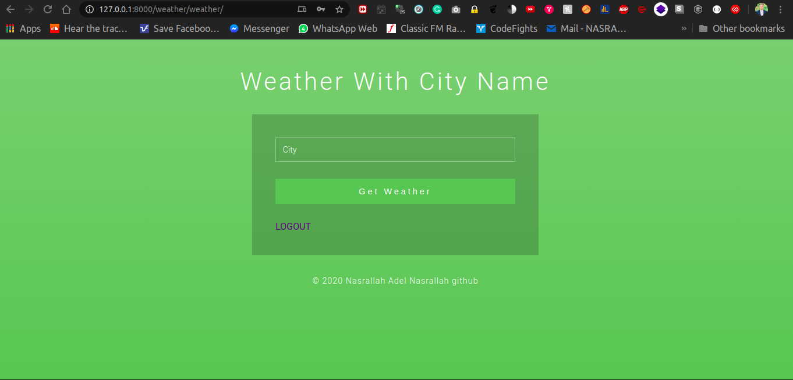

# *weather*
By Using the Django Rest Framework (check link here: https://www.django-rest-framework.org), I build a service that
 authenticates a user and displays the temperature of his requested city.
1. Create simple API endpoints for:
    - registration
    - login

2. Create simple API endpoint that takes the city and return its weather.
    - consume the API using Django and return its results in JSON format.
    - Use API for weather from [weatherstack.com](weatherstack)
    
3. Build a simple html interface that:
    - allows the user to login using his credentials and register.
    - another interface that allows authenticated users to enter a city and get its weather conditions. 

## *To download and run Project*

1. in your terminal run this command
   - ``git clone https://github.com/Nasrallah-Adel/weather.git``
2. move to project folder by 
   - ``cd weather``
3. use virtual environment [Conda or virtualenv] and create env for project and activate it
4. install project packages to your env by this command

   - ``pip install -r requirements.txt``
5. run project server by this command
   - ``python manage.py runserver 127.0.0.1:8000``

*your project will run on ``127.0.0.1:8000``*
#project Documentation
  - ## API Documentation
  #######Note For postman URL : [PostMan Collection URL](https://www.getpostman.com/collections/5fd6aa6843677e8ffaea) . File json :[Postman Json File](https://github.com/Nasrallah-Adel/weather/blob/master/Weather.postman_collection.json)
 have three url in Api app 
1. ``POST : 127.0.0.1:8000/apis/register`` this register endpoint to create new user 

     - POST data of user in this format 
        ```json
        {  
           "username": "string",
           "password": "string"
        }
        ````
     - you will receive Response in this format
       ```json
             {
               "id": int,
               "username": "string",
               "token": "string"
             }
        ```
       
2. ``POST : 127.0.0.1:8000/apis/login`` this login endpoint to authenticate exist user 

     - POST data of user in this format 
          ```json
         {  
           "username": "string",
           "password": "string"
         }
         ````
     - you will receive Response in this format
       ```json
         {
            "token": "string"
         }
       ```
       you will use this token to can invoke ``127.0.0.1:8000/apis/weather/:city`` API endpoint
       
3. ``GET 127.0.0.1:8000/apis/weather/{city}/`` this WEATHER endpoint to retrieve weather data for specific city 
    
     - example
     
       - Use GET method to call ``127.0.0.1:8000/apis/weather/cairo/`` but you need add to request header
        ``Authorization: TOKEN <your token from login or register>`` to allow just auth user to call api
        - if you write good city name ( cairo ) you will receive this response
            ```json
                  {
                      "location_name": "Cairo",
                      "location_country": "Egypt",
                      "location_region": "Al Qahirah",
                      "location_timezone": "Africa/Cairo",
                      "location_temperature": 16,
                      "location_weather_icons": [
                        "https://assets.weatherstack.com/images/wsymbols01_png_64/wsymbol_0002_sunny_intervals.png"
                      ],
                      "location_weather_descriptions": [
                        "Partly cloudy"
                      ]
                  }
            ```
         
            - if you write bad city name you will get error response
            ```json
                  {
                     "error_type": "request_failed",
                     "error_info": "Your API request failed. Please try again or contact support."
                  } 
            ```
          
  - ## interface Documentation
  
  1. ```http://127.0.0.1:8000/docs``` for swagger documentation for api
  
  
  2. ```http://127.0.0.1:8000/weather/login/``` for login
  
  
  3. ```http://127.0.0.1:8000/weather/register/``` for register
  
  
  4. ```http://127.0.0.1:8000/weather/``` interface of weather form to take city name
  
  
  
  after enter correct city name (cairo) and submit get weather button you will git data like 
  
  
  
  if not correct city name you will get 
   
   
    